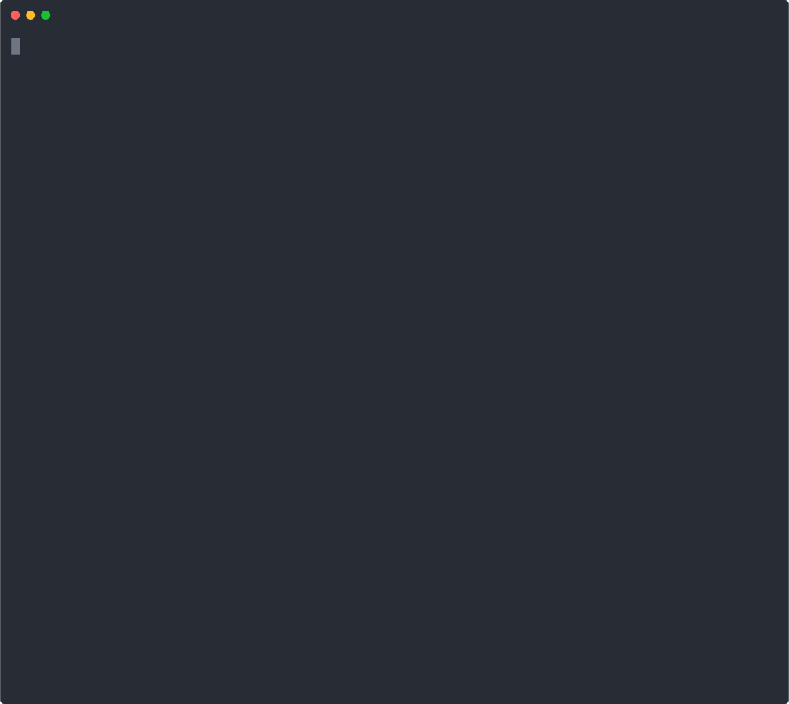

# get-markdown-images
get all images from markdown

<p align="center">
	<br>
	
	<br>
</p>


## Usage
```bash
npx get-markdown-images --inputDir='./docs'
```

OR

```bash
npm install get-markdown-images
```

```js
const { downloadImages } = require('get-markdown-images')

downloadImages({
  inputDir: './docs'
})
```
